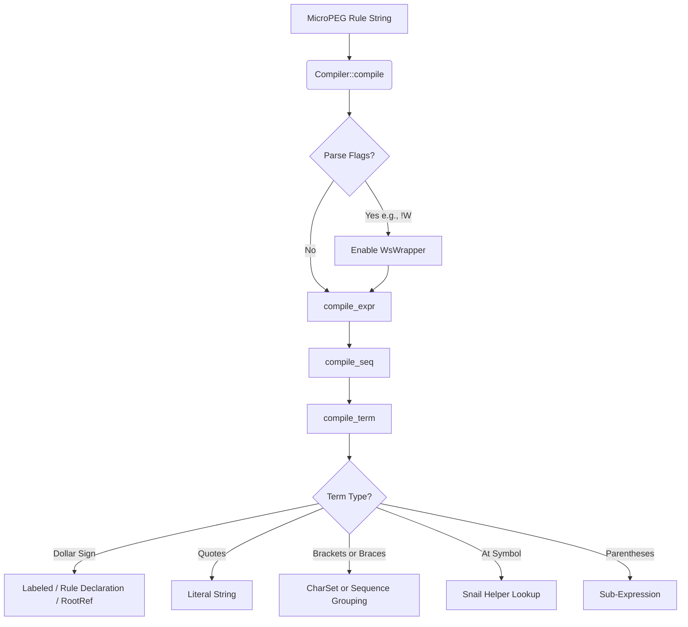
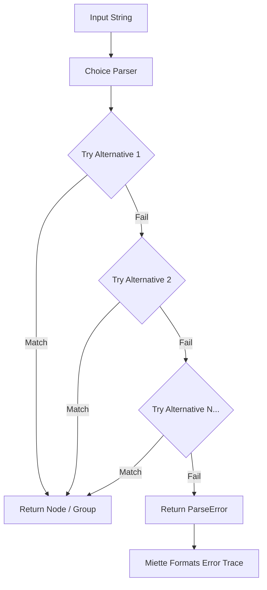

# MicroPEG (mpeg)

[](https://crates.io/crates/mpeg-parser)
[](https://docs.rs/mpeg-parser)

An expression-based parsing engine and DSL designed for code golfing. MicroPEG compiles compact, single-string grammars into executable, AST-producing parsers.

## Installation

Add this to your `Cargo.toml`:

```toml
[dependencies]
mpeg-parser = "0.1.0"
```

## Core Features

* **Single-Expression Rules:** Grammars are defined as a single root expression. Self-references (`$_`) handle recursion implicitly.
* **Built-in Snails (`@`):** Pre-built macros handle common patterns like numbers (`@.`) and operator precedence (`@>`) to minimize syntax overhead.
* **Inline AST Tagging & Declarations (`$X(...)`):** Wrap matched expressions into labeled AST nodes and declare reusable sub-rules directly within the expression string.
* **Rule References (`$x`):** Recursively reference previously declared rules to keep your grammar DRY.
* **Order-of-Appearance Precedence:** Operator precedence tiers are determined by their sequence in a character class (e.g., `[*/+-]` implies `*` and `/` bind tighter than `+` and `-`).
* **Modular Rust Backend:** Built on zero-cost combinators with a centralized dispatch system for easy extension.

## Syntax Reference

| Construct | Description | Example |
| --- | --- | --- |
| `A \| B` | Ordered choice (try A, fallback to B) | `"true" \| "false"` |
| `A*` | Zero or more repetitions | `("," $_)*` |
| `$_` | Self-reference to the root parser | `[$_(,$_)*]` |
| `$X(...)` | Labeled AST node & Rule Declaration | `$V(@. \| @")` |
| `$x` | Reference to previously declared rule | `$v` |
| `@.` | Number primitive snail | `@.` |
| `@"` | String primitive snail | `@"` |
| `@>` | Precedence parsing snail | `@>P@.[*/+-]@.` |
| `!W` | Whitespace skip flag | `!W $Y(...)` |

## Parsing Pipeline

`mpeg` operates in two main phases: **Compilation** (where your `.mpeg` rules are transformed into an AST of parser traits) and **Parsing** (where an input string is evaluated against that parser tree).

### 1. Compilation Phase
When `compile()` evaluates an `.mpeg` rule string, it builds an execution tree of combinators (`Sequence`, `Choice`, `Literal`, `ZeroOrMore`, etc.).



### 2. Execution Phase (Parsing)
During parsing, the combinatorial tree attempts to chew through the input string. `Choice` parsers act as fallback points, prioritizing the highest match, while `Sequence` demands strict chronological matches.

