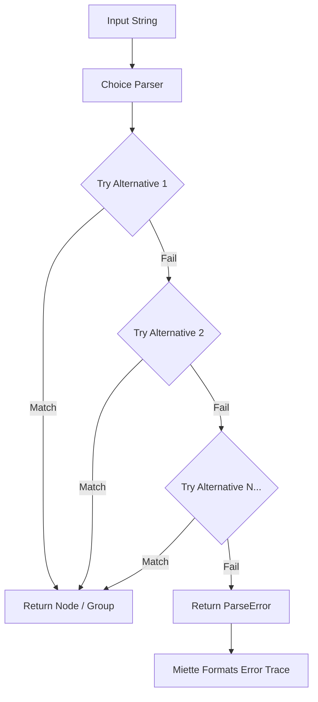

# mparse - MicroPEG Parser Engine

Welcome to `mparse`! The `examples/` directory contains simplified grammars demonstrating how to parse structured formats like JSON, CSV, TOML, YAML, and Math equations using the `mparse` MicroPEG syntax.

## Parsing Pipeline

`mparse` operates in two main phases: **Compilation** (where your `.mpeg` rules are transformed into an AST of parser traits) and **Parsing** (where an input string is evaluated against that parser tree).

### 1. Compilation Phase
When `compile()` evaluates an `.mpeg` rule string, it builds an execution tree of combinators (`Sequence`, `Choice`, `Literal`, `ZeroOrMore`, etc.).

```mermaid
flowchart TD
    A[mparse Rule String] --> B(Compiler::compile)
    B --> C{Parse Flags?}
    C -->|Yes e.g., !W| D[Enable WsWrapper]
    C -->|No| E[compile_expr]
    D --> E
    E --> F[compile_seq]
    F --> G[compile_term]
    G --> H{Term Type?}
    H -->|$| I[Labeled / RootRef]
    H -->|"| J[Literal String]
    H -->|"[ " or "{ "| K[CharSet or Sequence Grouping]
    H -->|@| L[Snail Helper Lookup]
    H -->|(| M[Sub-Expression]
```

### 2. Execution Phase (Parsing)
During parsing, the combinatorial tree attempts to chew through the input string. `Choice` parsers act as fallback points, prioritizing the highest match, while `Sequence` demands strict chronological matches.



## Flags & Snails

### Flags (e.g. `!W`)
Flags can be placed at the very top of your `.mpeg` file to toggle global compiler behavior. 
- **`!W` (Whitespace Skipper):** Automatically wraps every term in your sequence with a `WsWrapper`, skipping all leading whitespace (spaces, tabs, newlines). This allows you to write clean structural grammars (like `yaml_w.mpeg`) without polluting them with manual whitespace parsers!

### Snails (`@`)
Snails are built-in native Rust parsing helpers that extend `mparse` beyond standard PEG character matching. 
- `@w` : Alphanumeric words
- `@.` : Numbers (integers, floats)
- `@"` / `@'` : Quoted Strings
- `@b` / `@B` : Booleans
- `@_` : Optional Whitespace consumer (useful if `!W` is not enabled)

Explore the examples in this directory to see them in action!

### Labels & Rule References (`$X` vs `$x`)
`mparse` allows you to declare labeled sub-rules and refer back to them recursively. This helps keep grammars like TOML clean by avoiding duplicated sub-trees!

- **Declaration / Labeling (`$X`)**: 
  Using an uppercase letter after `$` (e.g., `$V(...)`) labels the resulting AST node with `"V"` and simultaneously **declares** that parser logic into the environment under the rule name `V`. 
  *Note: `$_` is a special reference that always refers back to the very root of your grammar.*
- **Reference (`$x`)**: 
  Using a lowercase letter (e.g., `$v`) acts as a **reference** back to the rule previously declared by `$V`. This will execute the `V` rule without needing to redefine it.

*(See `toml.mpeg` for a perfect example of `$V` declaring the Value rule, and `$v` recursively referring back to it inside the Array rule!)*
