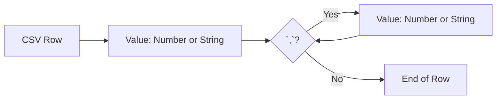
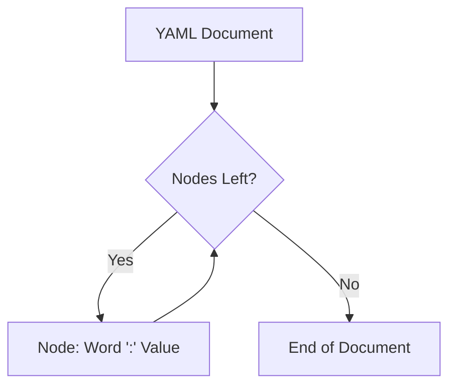

# mparse Examples

This directory contains simplified grammars demonstrating how to parse structured formats using the `mparse` MicroPEG syntax. 

Below are visual breakdowns (using Mermaid) of how the grammar rules in these examples structure their parsing logic. For the full guide on `mparse` DSL, flags, snails, and rule references, see the [Root README](../README.md).

---

## 1. JSON (`json.mpeg`)
A recursive grammar representing standard JSON types. The root rule is a choice between Object, Array, String, Number, Boolean, or Null.

```mermaid
flowchart TD
    Root[JSON Value] --> Choice{Match?}
    Choice -->|`{`| Obj[Object: String : Value]
    Choice -->|`[`| Arr[Array: Value , Value ...]
    Choice -->|`@"`| Str[String]
    Choice -->|`@.`| Num[Number]
    Choice -->|`@b`| Bool[Boolean]
    Choice -->|`null`| Null[Null]
    
    Obj -.-> Root
    Arr -.-> Root
```

## 2. Math (`math.mpeg`)
A recursive grammar handling operator precedence and parentheses grouping for simple math equations.

```mermaid
flowchart TD
    Root[Equation] --> Choice{Match?}
    Choice -->|`@>P`| Op[Operation: Number Operator Number]
    Choice -->|`$P`| Parens[Parentheses: '(' Equation ')']
    
    Parens -.-> Root
```

## 3. CSV (`csv.mpeg`)
A flat sequence parser that expects a leading value, optionally followed by zero or more comma-separated values.



## 4. INI (`ini.mpeg`)
Parses a standard configuration block starting with a section header, followed by zero or more key-value assignments.

```mermaid
flowchart TD
    Doc[INI Document] --> Sec[Section: '[' Word ']']
    Sec --> More{More?}
    More -->|Yes| KVP[Key = Value]
    KVP --> More
    More -->|No| End[End of Document]
```

## 5. YAML (`yaml_w.mpeg`)
Showcases the `!W` (Whitespace Skipper) flag. Parses a sequence of key-value nodes without manually declaring whitespace snails.



## 6. TOML (`toml.mpeg`)
A complex grammar demonstrating recursive arrays and rule references (`$V` and `$v`). The root evaluates zero or more elements, which can be either a Section or a Key-Value pair.

```mermaid
flowchart TD
    Doc[TOML Document] --> Elem{Match Element?}
    Elem -->|`[`| Sec[Section: '[' Word ']']
    Elem -->|Word| KVP[Assignment: Word '=' Value]
    
    Sec --> Elem
    KVP --> Elem
    Elem -->|No Matches| End[End of Document]
    
    KVP -.-> Val{Value Type?}
    Val --> Primitive[Primitive: String/Number/Bool]
    Val --> Array[Array: '[' Value , ... ']']
    Array -.-> Val
```
